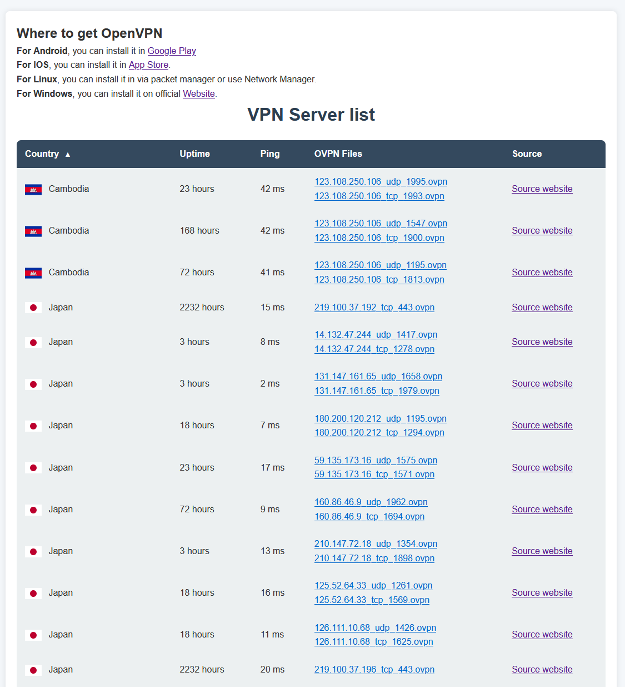

#  VPN Scraper Project 

## This project is a Flask-based web application that scrapes, stores, and displays VPN server information. The application provides an easy-to-navigate interface with sortable tables and allows users to download OpenVPN configuration files for selected servers. 

## Features 

- **VPN Scraper**: Automatically scrapes VPN server details and configuration files.
- **Database**: Stores VPN server details in an SQLite database.
- **Web Interface**: Displays VPN server information with sorting options (by country, uptime, or ping).
- **Downloadable Config Files**: Links to OpenVPN configuration files for easy setup.
- **Flags Display**: Shows country flags using SVG images.

## Requirements 

- Python 3.8+ 

- Docker and Docker Compose 

## Installation

### 1. Clone the repository:   ``` git clone https://github.com/turovsm/vpn_scraper_project.git ```

### 2. Go into cloned directory: ```cd vpn_scraper_project```

### 3. Build and run the project: ```./build.sh```

### 4. Open your browser and navigate to: ```http://localhost:5000```


## DEMO:



## Credit to these websites:

- https://download.vpngate.jp/en/ For a list of VPN servers (scraping)
- https://ipspeed.info/freevpn_openvpn.php?language=en For a list of VPN servers (scraping)

- https://github.com/hampusborgos/country-flags/tree/main For country flags
